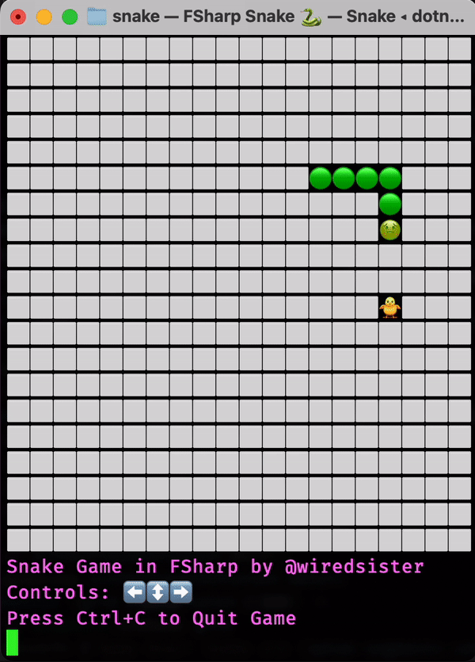

# Snake.fs

A simple CLI Snake written in F#

Cited in [Rosetta Code Snake](https://rosettacode.org/wiki/Snake#F#) examples!



## Prerequisites

Dotnet:
- https://dotnet.microsoft.com/en-us/download 

## Running locally

```sh
dotnet build
```

```sh
dotnet run
```
